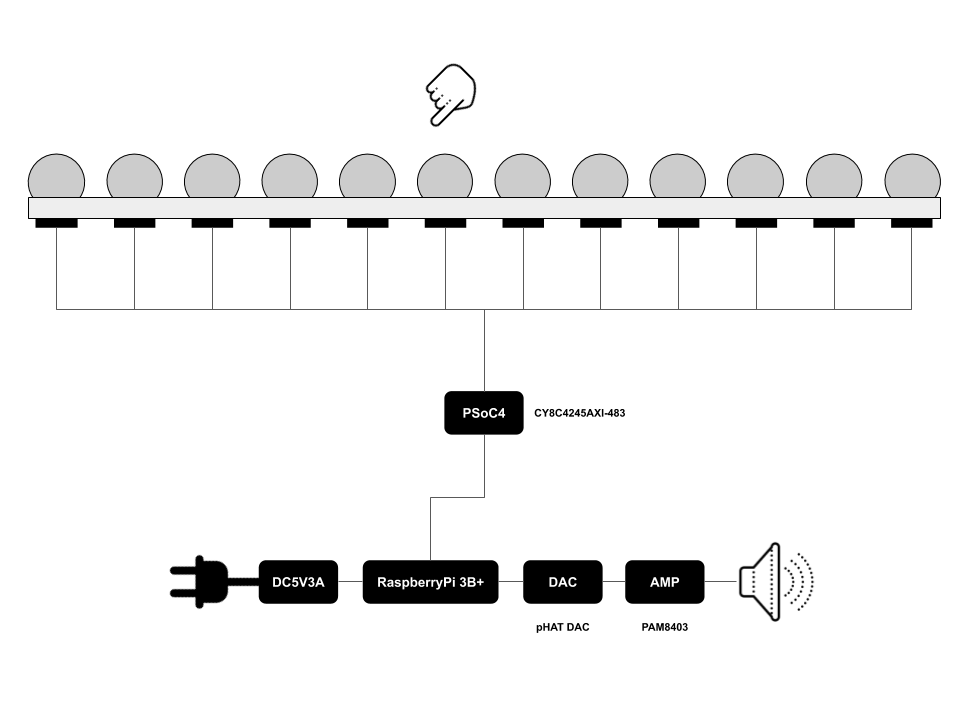
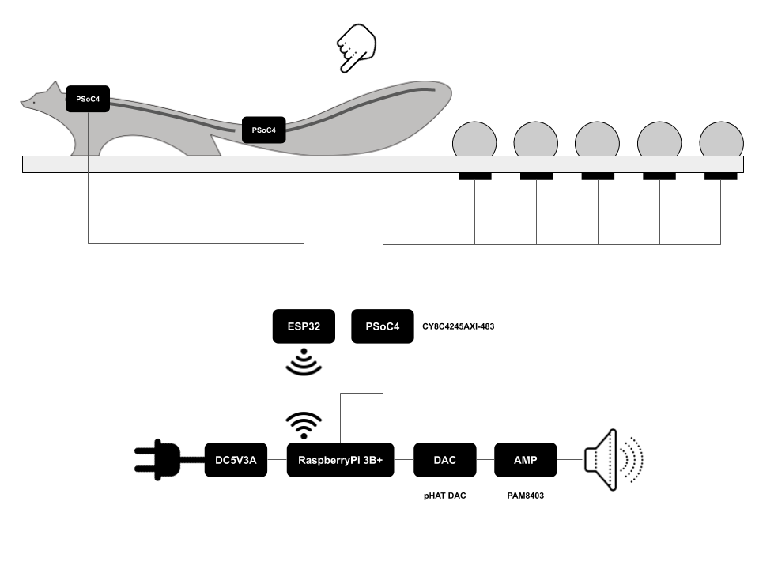

# utsushiomi

<a href ="https://mathrax.com/contents/page10523">utsushiomi</a>

</img>
基本的なシステム

</img>
キツネのあるシステム

A table with many wooden objects is connected. You will hear a sound when you touch a wooden object. It is an experience-based work that relies on the actual changes in sound, texture, light, and scent, and relies on the senses to walk forward. Even visually impaired, hearing impaired, wheelchairs and young children can experience them in different senses.
